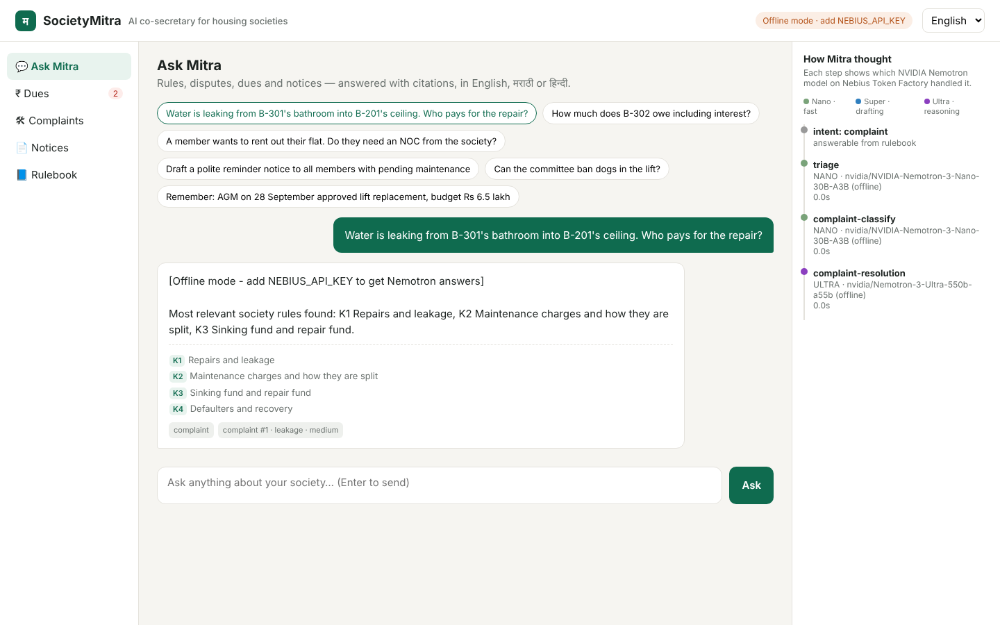
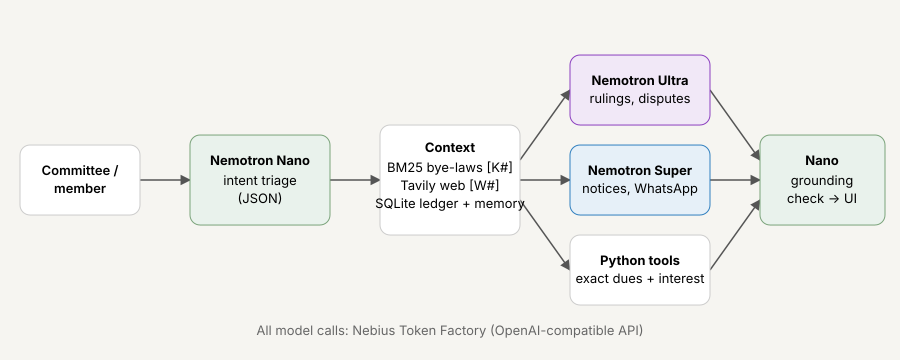

# SocietyMitra — an AI co-secretary for housing societies

**Nebius x NVIDIA Global AI Hackathon · Best Apps and Agents track**

Maharashtra alone has over a lakh co-operative housing societies, almost all run by unpaid volunteer committees: a retired uncle as secretary, a working parent as treasurer. They field the same questions every week — *who pays for this leakage? can we stop tenants? how much interest can we charge?* — answer from memory, draft notices in Word at midnight, and calculate arrears in Excel. Mistakes turn into neighbour fights, Registrar complaints and court cases.

SocietyMitra gives every committee a patient, multilingual co-secretary that **knows the rules, cites them, does the maths exactly, and drafts the paperwork** — in English, मराठी or हिन्दी.





## What it does

| Feature | How |
|---|---|
| **Rule answers with citations** | Retrieves the matching bye-law sections (BM25), adds live legal/government sources from **Tavily** when the rulebook isn't enough, and **Nemotron 3 Ultra** writes a verdict → why → what the committee should do, citing `[K#]` / `[W#]` for every claim. |
| **Grounding check** | A second, independent **Nemotron Nano** pass flags any claim not supported by the sources and shows it in the UI. |
| **Dispute & complaint desk** | Nano classifies category and urgency; Ultra decides who is responsible and drafts a fair written reply; the complaint is logged on a board. |
| **Exact dues & defaulters** | Arrears and simple interest (capped at the 21% p.a. bye-law limit) are computed in Python — the LLM only explains numbers, never invents them. |
| **Notices & WhatsApp** | **Nemotron Super** drafts formal notices/circulars plus a short WhatsApp version, in the chosen language. |
| **Society memory** | "Remember: AGM approved lift replacement, ₹6.5 lakh" is stored and used in every later answer. |
| **Bring your own bye-laws** | Upload your society's bye-laws text and answers become specific to you. |
| **Transparent reasoning** | The *How Mitra thought* panel shows every step, which Nemotron model ran it, latency and tokens. |

## How NVIDIA Nemotron + Nebius Token Factory are used

All inference runs on **Nebius Token Factory** (OpenAI-compatible API, `https://api.tokenfactory.nebius.com/v1`). SocietyMitra routes each step to the right-sized Nemotron model, exactly as the track suggests:

| Tier | Model (auto-discovered) | Used for | Why |
|---|---|---|---|
| Nano | `NVIDIA Nemotron 3 Nano` | intent triage (JSON), complaint classification, grounding check | 3 calls per question, must be fast and cheap |
| Super | `NVIDIA Nemotron 3 Super` | notices, WhatsApp drafts, dues explanations | good writing, low latency |
| Ultra | `NVIDIA Nemotron 3 Ultra` | bye-law rulings, dispute resolution | multi-source legal reasoning where mistakes are costly |

Model IDs are resolved at startup from `/v1/models` (see `mitra/llm.py`), so the app keeps working if Nebius versions a model. You can pin IDs with env vars.

**Where Token Factory accelerated the work:** one API key gives three Nemotron sizes behind the same OpenAI-style endpoint, so tier routing is a one-line change per step, and JSON output on Nano keeps triage structured. Because cheap steps go to Nano, each question needs only one call to the large Ultra reasoning model.

## Quick start

```bash
git clone https://github.com/swapnilchaudhari007/societymitra && cd societymitra
python -m venv .venv && source .venv/bin/activate
pip install -r requirements.txt
cp .env.example .env            # add NEBIUS_API_KEY (and optionally TAVILY_API_KEY)
export $(grep -v '^#' .env | xargs)
uvicorn app:app --reload        # open http://localhost:8000
```

Without `NEBIUS_API_KEY` the app runs in a clearly-labelled **offline mode** (keyword triage + retrieval only) so you can explore the UI and run tests.

### Docker / hosting
```bash
docker build -t societymitra . && docker run -p 7860:7860 -e NEBIUS_API_KEY=... -e TAVILY_API_KEY=... societymitra
```
The same Dockerfile deploys to Hugging Face Spaces (Docker SDK), Render, or a **Nebius Serverless Endpoint** (port 7860).

### Tests
```bash
pip install pytest && pytest -q
```

## Project layout
```
app.py                 FastAPI server + REST API
mitra/llm.py           Token Factory client, Nemotron tier routing, model discovery
mitra/agent.py         Triage → retrieve → (Tavily) → Ultra/Super → Nano grounding check
mitra/rag.py           Dependency-free BM25 over bye-law sections
mitra/tools.py         Exact dues/interest maths, Tavily search
mitra/store.py         SQLite: members, dues, complaints, notices, memory (demo data seeded)
knowledge/             Plain-language Maharashtra housing-society rulebook
static/index.html      Single-page UI
scripts/record_demo.py Screen-capture script for the demo video
```

## Demo data
The seeded society ("Sunrise B Wing CHS", 8 flats) and all member names are fictional.

## Disclaimer
SocietyMitra gives guidance, not legal advice. The bundled rulebook is a plain-language summary; committees should confirm important decisions against their registered bye-laws, the Maharashtra Co-operative Societies Act 1960 and current Government Resolutions.

## License
MIT — see [LICENSE](LICENSE).
